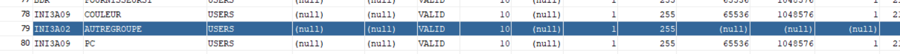
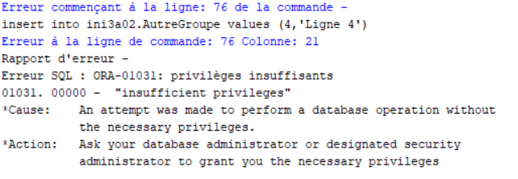

# Partie 1 : Transactions

## Atomicité d’une transaction courante

### 1° Créer une table et manipuler des données :

- **Création de la table et insertion de lignes :**
  ```sql
  CREATE TABLE MaTable (id INT PRIMARY KEY, nom VARCHAR(50));
  INSERT INTO MaTable (id, nom) VALUES (1, 'Ligne 1');
  INSERT INTO MaTable (id, nom) VALUES (2, 'Ligne 2');
  INSERT INTO MaTable (id, nom) VALUES (3, 'Ligne 3');
  SELECT * FROM MaTable;
  ```

- **Modification, suppression et annulation :**
  ```sql
  UPDATE MaTable SET nom = 'Nouveau Nom' WHERE id = 1;
  DELETE FROM MaTable WHERE id = 2;
  SELECT * FROM MaTable;
  ROLLBACK;
  SELECT * FROM MaTable;
  ```

### 2° Valider et annuler des mises à jour :

- **Mises à jour, validation, puis ROLLBACK :**
  ```sql
  INSERT INTO MaTable VALUES (4, 'Ligne 4'), (5, 'Ligne 5');
  UPDATE MaTable SET nom = 'Modifié' WHERE id = 4;
  DELETE FROM MaTable WHERE id = 5;
  COMMIT;
  ROLLBACK;
  ```
  La validation a empêché le ROLLBACK de supprimer les modifications.
- **Suppression des données :**
  ```sql
  DELETE FROM MaTable;
  COMMIT;
  SELECT * FROM MaTable;
  ```

### 3° Fermer une transaction avec EXIT ou QUIT :

- **Insérer des lignes et clore avec EXIT/QUIT :**
  ```sql
  INSERT INTO MaTable (id, nom) VALUES (1, 'Ligne 1');
  INSERT INTO MaTable (id, nom) VALUES (2, 'Ligne 2');
  INSERT INTO MaTable (id, nom) VALUES (3, 'Ligne 3');
  EXIT;
  ROLLBACK;
  ```
  Nous avons été déconnectés de la base de données et les modifications ont été validées.

### 4° Fermer brutalement la session et revenir :

- **Fermer brutalement et vérifier la persistance des données :**
  ```sql
  INSERT INTO MaTable (id, nom) VALUES (4, 'Ligne 4');
  INSERT INTO MaTable (id, nom) VALUES (5, 'Ligne 5');
  ```
  La session a été fermée brutalement et les modifications n'ont pas été validées.

### 5° Manipuler les données et la structure de la table :

- **Insertions, ajout de colonne et annulation :**
  ```sql
  INSERT INTO MaTable (id, nom) VALUES (6, 'Ligne 6');
  INSERT INTO MaTable (id, nom) VALUES (7, 'Ligne 7');
  ALTER TABLE MaTable ADD nouvelle_colonne INT;
  ROLLBACK;
  ```
  La colonne a bien été ajoutée mais le ROLLBACK a supprimé toutes les données.

### 6° Conclusion sur les transactions :

- **Qu'est-ce qu'une transaction et comment valider ou annuler :**
  Une transaction est une unité de travail. Lorsqu'une transaction aboutit, toutes les modifications sont validées mais si une transaction rencontre des erreurs et doit être annulée ou restaurée, toutes les modifications de données sont supprimées.
  On peut valider les changements avec `COMMIT` et les annuler avec `ROLLBACK`.

## Plusieurs sessions sur un seul compte de BD et transactions concurrentes

### 1° Connexion depuis une autre fenêtre :

- **Se connecter depuis une autre fenêtre :**
  Toutes les données validées sont visibles.

### 2° Insérer des lignes depuis les deux fenêtres :

- **Insérer des lignes depuis les deux fenêtres :**
  Les modifications faites dans l'autre fenêtre ne sont pas visibles. On ne peut les voir qu'après validation avec `COMMIT`.

### 3° Créer une nouvelle table depuis une fenêtre :

- **Créer une nouvelle table et insérer des lignes :**
  La nouvelle table est visible dans l'autre fenêtre mais les lignes insérées ne le sont pas.

### 4° Détruire la nouvelle table :

- **Détruire la nouvelle table :**
  La table est détruite dans les deux fenêtres.

### 5° Ajouter une clé à la table et tester le ROLLBACK :

- **Ajouter une clé et tester le ROLLBACK :**
  Sur la deuxième fenêtre à faire la modification, SQLDevelopper se bloque. Tant que les modifications ne sont pas validées ou annulées sur la première fenêtre, la deuxième fenêtre reste blockée.

### 6° Fermer la session dans la fenêtre d'insertion :

- **Fermer la session avec EXIT ou QUIT :**
  Quand on se déconnecte proprement, les modifications sont validées et visibles dans les autres fenêtres.

### 7° Ouvrir une nouvelle session :

- **Ouvrir une nouvelle session et vérifier la dernière transaction :**
  Les modifications de la dernière transaction sont visibles dans la nouvelle session.

### 8° Insérer une ligne, créer une nouvelle table et ROLLBACK :

- **Insérer une ligne, créer une nouvelle table et ROLLBACK :**
  La création de la nouvelle table a validé les données. On peut donc voir la ligne insérée avant la création de la table et la nouvelle table mais pas la ligne insérée après la création de la table.

### 9° Insérer une ligne, éliminer une table et ROLLBACK :

- **Insérer une ligne, éliminer une table et ROLLBACK :**
  La suppression de la table a validé les données. On peut donc voir la ligne insérée avant la suppression de la table et la table a bien été supprimée.

## Droits/privilèges entre deux comptes d’une même base de données

### 1° Accorder le droit SELECT à l'autre groupe :

- **Accorder le droit SELECT à l'autre groupe :**
  ```sql
  -- Dans le groupe 02 :
  CREATE TABLE AutreGroupe (id INT PRIMARY KEY, nom VARCHAR(50));
  INSERT INTO AutreGroupe (id, nom) VALUES (1, 'Ligne 1');
  INSERT INTO AutreGroupe (id, nom) VALUES (2, 'Ligne 2');
  INSERT INTO AutreGroupe (id, nom) VALUES (3, 'Ligne 3');
  GRANT SELECT ON AutreGroupe TO INI3A09;
  ```
  **Vérifier le privilège accordé :**
  ```sql
  -- Dans le groupe 09 :
  SELECT * FROM ALL_TABLES;
  SELECT * FROM INI3A02.AutreGroupe;
  ```
  Le groupe 09 peut voir la table du groupe 02.
  

### 2° Observer les mises à jour de l'autre groupe :

- **Observer les mises à jour de l'autre groupe :**
  Si le groupe 02 insère une ligne dans la table et fait un `COMMIT`, le groupe 09 peut la voir mais pas la modifier.

### 3° Essayer d'insérer une ligne dans la table de l'autre groupe :

- **Essayer d'insérer une ligne sans le droit INSERT :**
  Le groupe 09 ne peut pas insérer de ligne dans la table du groupe 02.
  

### 4° Accorder le droit INSERT par l'autre groupe :

- **Accorder le droit INSERT par l'autre groupe :**
  ```sql
  -- Dans le groupe 02
  GRANT INSERT ON AutreGroupe TO INI3A09;
  ```
  *Reprendre l'insertion :*
  ```sql
  -- Dans le groupe 1
  INSERT INTO groupe2.MaTable VALUES (1, 'Nouvelle Ligne');
  ```

### 5° Réaliser une jointure entre les tables des deux groupes :

- *Réaliser une jointure entre les tables des deux groupes :*
  ```sql
  -- Dans le groupe 1
  SELECT * FROM MaTable JOIN groupe2.MaTable ON MaTable.id = groupe2.MaTable.id;
  ```

Ces étapes illustrent comment accorder des droits SELECT et INSERT entre deux groupes dans une base de données, ainsi que comment vérifier les privilèges accordés. Les jointures entre les tables de différents groupes sont également possibles avec les droits appropriés.


### 1. Copier les tables dans votre compte :

```sql
CREATE TABLE Dept AS SELECT * FROM Scott.Dept;
CREATE TABLE Emp AS SELECT * FROM Scott.Emp;
CREATE TABLE Salgrade AS SELECT * FROM Scott.Salgrade;
```

### 2. Requêtes SQL :

a. **Employés dirigés par 'King' :**
```sql
SELECT EName FROM Emp WHERE Mgr = (SELECT EmpNo FROM Emp WHERE EName = 'King');
```

b. **Employés dépendant de 'Jones' :**
```sql
SELECT EName FROM Emp START WITH EName = 'Jones' CONNECT BY PRIOR EmpNo = Mgr;
```

c. **Employés dont dépend 'Jones' :**
```sql
SELECT EName FROM Emp START WITH Mgr = (SELECT EmpNo FROM Emp WHERE EName = 'Jones') CONNECT BY PRIOR EmpNo = Mgr;
```

d. **Employés dépendant de 'Blake', sauf 'Blake' lui-même :**
```sql
SELECT EName FROM Emp WHERE Mgr = (SELECT EmpNo FROM Emp WHERE EName = 'Blake') AND EmpNo != (SELECT EmpNo FROM Emp WHERE EName = 'Blake');
```

e. **Employés dépendant de 'King' sauf ceux dépendant de 'Blake' :**
```sql
SELECT EName FROM Emp 
WHERE Mgr IN (SELECT EmpNo FROM Emp WHERE EName = 'King') 
AND Mgr NOT IN (SELECT EmpNo FROM Emp WHERE EName = 'Blake');
```

### 3. Fonction PL/SQL pour le nombre d'employés par département :

```sql
CREATE OR REPLACE FUNCTION GetEmpCount(p_deptno Emp.DeptNo%TYPE) RETURN NUMBER
IS
  v_count NUMBER;
BEGIN
  SELECT COUNT(*) INTO v_count FROM Emp WHERE DeptNo = p_deptno;
  RETURN v_count;
END;
/

-- Appeler la fonction dans un bloc PL/SQL
DECLARE
  v_result NUMBER;
BEGIN
  v_result := GetEmpCount(20); -- Exemple avec le département 20
  DBMS_OUTPUT.PUT_LINE('Nombre d''employés : ' || v_result);
END;
/

### 4. Ajouter la colonne NbEmps à la table Dept :

a. **En utilisant la fonction stockée :**
```sql
ALTER TABLE Dept ADD NbEmps NUMBER;

UPDATE Dept d
SET d.NbEmps = GetEmpCount(d.DeptNo);
```

b. **En utilisant un curseur :**
```sql
ALTER TABLE Dept ADD NbEmps NUMBER;

DECLARE
  CURSOR C1 IS SELECT DeptNo FROM Dept;
  v_count NUMBER;
BEGIN
  FOR C1_enr IN C1 LOOP
    v_count := GetEmpCount(C1_enr.DeptNo);
    UPDATE Dept SET NbEmps = v_count WHERE DeptNo = C1_enr.DeptNo;
  END LOOP;
END;
/

### 5. Déclencheur pour mettre à jour le nombre d'employés :

```sql
CREATE OR REPLACE TRIGGER UpdateEmpCount
AFTER INSERT OR DELETE OR UPDATE OF DeptNo ON Emp
FOR EACH ROW
BEGIN
  UPDATE Dept SET NbEmps = GetEmpCount(:NEW.DeptNo) WHERE DeptNo = :NEW.DeptNo;
END;
/

### 6. Procédure pour mettre à jour le département de toute une équipe :

```sql
CREATE OR REPLACE PROCEDURE UpdateTeamDept(p_empno Emp.EmpNo%TYPE, p_new_deptno Dept.DeptNo%TYPE)
IS
BEGIN
  -- Mettre à jour le département de toute l'équipe
  UPDATE Emp SET DeptNo = p_new_deptno
  WHERE EmpNo IN (SELECT EmpNo FROM Emp START WITH EmpNo = p_empno CONNECT BY PRIOR EmpNo = Mgr);
END;
/
```