Jules GINHAC et Dorian TONNIS

# TT BD1

## 1. Créez un lien de base de données dans votre compte ORAPEDA3 vers votre compte ORAPEDA2 :

```sql
CREATE DATABASE LINK ORAPEDA2 USING 'ORAPEDA2';
```


Vous pouvez vérifier les propriétés du lien en consultant la vue USER_DB_LINKS :

```sql
SELECT * FROM USER_DB_LINKS;
```

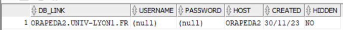

## 2. Accéder à la structure de votre table dans la base de données ORAPEDA2 :

```sql
DESC MaTableTT@ORAPEDA2;
```

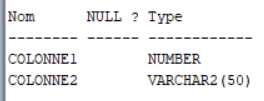

## 3. Accéder de votre compte de la base ORAPEDA3 au contenu de votre table dans la base de données ORAPEDA2 par la commande SELECT de SQL :

```sql
SELECT * FROM MaTable@ORAPEDA2;
```

## 4. Réaliser une jointure de votre table dans ORAPEDA2 avec une table de ORAPEDA3 :

```sql
SELECT *
FROM MaTableTT3 A JOIN MaTableTT@orapeda2 B ON A.id3 = B.Colonne1;
```

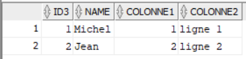

## 5. Mettre à jour votre table dans la base de données ORAPEDA2 à partir de votre compte dans ORAPEDA3. Détruire le lien entre les deux bases :

```sql
-- Mise à jour
UPDATE MaTableTT@ORAPEDA2
SET Colonne2 = 'Ligne 2 modifiée'
WHERE Colonne1 = 2;

SELECT * FROM MaTableTT@ORAPEDA2;

-- Destruction du lien
DROP DATABASE LINK ORAPEDA2;
```

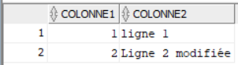
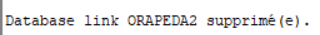


## 6. Rétablir le lien de ORAPEDA3 vers ORAPEDA2. Vérifier que le lien est bien rétabli :

```sql
-- Dans ORAPEDA3
CREATE DATABASE LINK ORAPEDA2 USING 'ORAPEDA2';

-- Vérification
SELECT * FROM MaTable@ORAPEDA2;
```

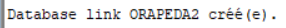
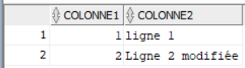

## 7. Sur ORAPEDA2, créer une table ClientLyon et CommandeLyon. De la même manière créer les tables ClientsParis et CommandesParis sur ORAPEDA3 :

```sql
-- Dans ORAPEDA2

CREATE TABLE ClientLyon (
    num NUMBER,
    nom VARCHAR2(50),
    prenom VARCHAR2(50),
    adresse VARCHAR2(100),
    ville VARCHAR2(50),
    CA NUMBER,
    TR NUMBER(3,2)
);

CREATE TABLE CommandeLyon (
    num NUMBER,
    datec DATE,
    numclt NUMBER,
    livraison VARCHAR2(3)
);

-- Dans ORAPEDA3

CREATE TABLE ClientsParis (
    num NUMBER,
    nom VARCHAR2(50),
    prenom VARCHAR2(50),
    adresse VARCHAR2(100),
    ville VARCHAR2(50),
    CA NUMBER,
    TR NUMBER(3,2)
);

CREATE TABLE CommandesParis (
    num NUMBER,
    datec DATE,
    numclt NUMBER,
    livraison VARCHAR2(3)
);
```

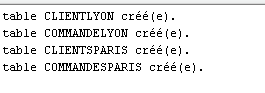

## 8. Transparence pour la fragmentation :

- Créer une vue clients sur ORAPEDA3 qui fait l'union des tables clients :

```sql
CREATE VIEW clients AS
    SELECT * FROM ClientsParis
    UNION
    SELECT * FROM ClientLyon;
```

- Créer une vue commandes sur ORAPEDA3 qui fait l'union des tables commandes :

```sql
CREATE VIEW commandes AS
    SELECT * FROM CommandesParis
    UNION
    SELECT * FROM CommandeLyon;
```

- Écrire une procédure stockée qui insère un nouveau client :

```sql
CREATE OR REPLACE PROCEDURE inserer_nouveau_client (
    p_num NUMBER,
    p_nom VARCHAR2,
    p_prenom VARCHAR2,
    p_adresse VARCHAR2,
    p_ville VARCHAR2,
    p_CA NUMBER,
    p_TR NUMBER
) AS
BEGIN
    IF p_ville = 'Paris' THEN
        INSERT INTO ClientsParis VALUES (p_num, p_nom, p_prenom, p_adresse, p_ville, p_CA, p_TR);
    ELSIF p_ville = 'Lyon' THEN
        INSERT INTO ClientLyon@orapeda2 VALUES (p_num, p_nom, p_prenom, p_adresse, p_ville, p_CA, p_TR);
    END IF;
END;
/
```

- Écrire une seconde procédure stockée qui insère une nouvelle commande :

```sql
-- Dans ORAPEDA3
CREATE OR REPLACE PROCEDURE inserer_nouvelle_commande (
    p_num NUMBER,
    p_datec DATE,
    p_numclt NUMBER,
    p_livraison VARCHAR2
) AS
    p_ville VARCHAR2(50);
BEGIN
    SELECT ville INTO p_ville
    FROM clients
    WHERE num = p_numclt;
    IF p_ville = 'Paris' THEN
        INSERT INTO CommandesParis VALUES (p_num, p_datec, p_numclt, p_livraison);
    ELSIF p_ville = 'Lyon' THEN
        INSERT INTO CommandeLyon@orapeda2 VALUES (p_num, p_datec, p_numclt, p_livraison);
    END IF;
END;
/
```

- Peupler les tables clients d'abord, puis les tables commandes des 2 bases à partir de ORAPEDA3 :

```sql
-- Dans ORAPEDA3
EXECUTE inserer_nouveau_client(1, 'Jean', 'Michel', '2 rue de la Paix', 'Paris', 2200, 2);
EXECUTE inserer_nouveau_client(2, 'Jane', 'Doe', '4 rue de la Fraternité', 'Paris', 3500, 3);
EXECUTE inserer_nouveau_client(3, 'Paul', 'Dupont', '6 avenue de la République', 'Lyon', 2500, 2);
EXECUTE inserer_nouveau_client(4, 'John', 'Doe', '3 rue de la Liberté', 'Lyon', 2500, 1);

EXECUTE inserer_nouvelle_commande(1, TO_DATE('2023-01-01', 'YYYY-MM-DD'), 1, 'oui');
EXECUTE inserer_nouvelle_commande(2, TO_DATE('2023-02-01', 'YYYY-MM-DD'), 1, 'non');
EXECUTE inserer_nouvelle_commande(3, TO_DATE('2023-03-01', 'YYYY-MM-DD'), 4, 'non');

COMMIT;
```

- Vérifier les insertions en interrogeant la vue clients et la table ClientLyon distante :

```sql
-- Dans ORAPEDA3
SELECT * FROM clients;
SELECT * FROM ClientLyon@ORAPEDA2;
```

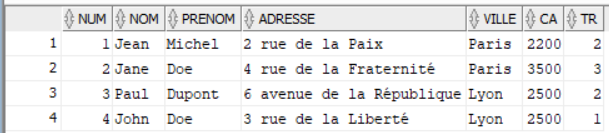
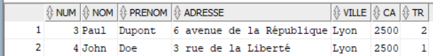

## 9. Analyser le plan d’exécution de chacune des requêtes suivantes :

- Créez la table destinée à recevoir les détails du plan d'exécution :

```sql
CREATE TABLE PLAN_TABLE (
    statement_id VARCHAR2(30),
    timestamp DATE,
    remarks VARCHAR2(80),
    operation VARCHAR2(30),
    options VARCHAR2(30),
    object_node VARCHAR2(128),
    object_owner VARCHAR2(30),
    object_name VARCHAR2(30),
    object_instance NUMBER,
    object_type VARCHAR2(30),
    optimizer VARCHAR2(255),
    search_columns NUMBER,
    id NUMBER,
    parent_id NUMBER,
    position NUMBER,
    cost NUMBER,
    cardinality NUMBER,
    bytes NUMBER,
    other_tag VARCHAR2(255),
    partition_start VARCHAR2(255),
    partition_stop VARCHAR2(255),
    partition_id NUMBER,
    other LONG,
    distribution VARCHAR2(30)
);
```

- Demandez à Oracle le plan d'exécution pour la requête R1 et stockez-le dans la table PLAN_TABLE :

```sql
EXPLAIN PLAN SET STATEMENT_ID = 'R1' FOR
SELECT *
FROM clients c
JOIN commandes cmd ON c.num = cmd.numclt
WHERE c.ville = 'Lyon';
```

- Interrogez la table PLAN_TABLE pour obtenir un plan d'exécution lisible :

```sql
SELECT LPAD(' ', 2 * (LEVEL - 1)) || operation || ' ' || options || ' ' || object_name || ' ' ||
       DECODE(id, 0, 'Cost = ' || position) "Query Plan"
FROM PLAN_TABLE
START WITH id = 0 AND statement_id = 'R1'
CONNECT BY PRIOR id = parent_id AND statement_id = 'R1';
```

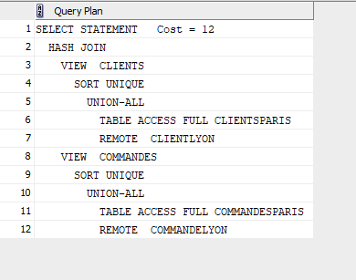

- Demandez à Oracle le plan d'exécution pour la requête R2 et stockez-le dans la table PLAN_TABLE :

```sql
EXPLAIN PLAN SET STATEMENT_ID = 'R2' FOR
SELECT *
FROM clients c1
JOIN clients c2 ON c1.nom = c2.nom
WHERE c1.ville = 'Paris' AND c2.ville = 'Lyon';
```

- Interrogez la table PLAN_TABLE pour obtenir un plan d'exécution lisible :

```sql
SELECT LPAD(' ', 2 * (LEVEL - 1)) || operation || ' ' || options || ' ' || object_name || ' ' ||
       DECODE(id, 0, 'Cost = ' || position) "Query Plan"
FROM PLAN_TABLE
START WITH id = 0 AND statement_id = 'R2'
CONNECT BY PRIOR id = parent_id AND statement_id = 'R2';
```

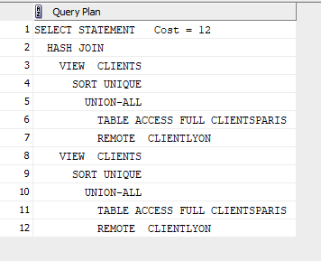

- Demandez à Oracle le plan d'exécution pour la requête R3 et stockez-le dans la table PLAN_TABLE :
   
```sql
EXPLAIN PLAN SET STATEMENT_ID = 'R3' FOR
SELECT *
FROM commandes cmd
JOIN clients c ON cmd.numclt = c.num
WHERE c.ville = 'Lyon' AND cmd.livraison = 'non';
```

- Interrogez la table PLAN_TABLE pour obtenir un plan d'exécution lisible :

```sql
SELECT LPAD(' ', 2 * (LEVEL - 1)) || operation || ' ' || options || ' ' || object_name || ' ' ||
       DECODE(id, 0, 'Cost = ' || position) "Query Plan"
FROM PLAN_TABLE
START WITH id = 0 AND statement_id = 'R3'
CONNECT BY PRIOR id = parent_id AND statement_id = 'R3';
```

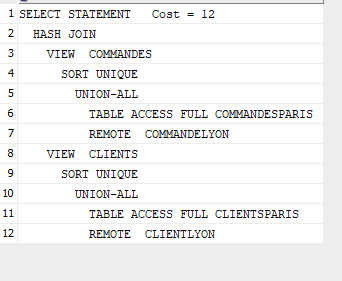

- Demandez à Oracle le plan d'exécution pour la requête R3 et stockez-le dans la table PLAN_TABLE :

```sql
EXPLAIN PLAN SET STATEMENT_ID = 'R4' FOR
SELECT *
FROM clients
WHERE ville = 'Lyon' AND CA > 2000;
```

- Interrogez la table PLAN_TABLE pour obtenir un plan d'exécution lisible :

```sql
SELECT LPAD(' ', 2 * (LEVEL - 1)) || operation || ' ' || options || ' ' || object_name || ' ' ||
       DECODE(id, 0, 'Cost = ' || position) "Query Plan"
FROM PLAN_TABLE
START WITH id = 0 AND statement_id = 'R4'
CONNECT BY PRIOR id = parent_id AND statement_id = 'R4';
```

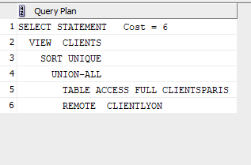

## 10 Réplications:

- Utiliser la commande COPY TO pour copier sur ORAPEDA2 les clients de Paris qui ont un CA>2000 sur une nouvelle table ClientsParis_CA_sup_2K :

```sql
COPY FROM @ORAPEDA3 TO @ORAPEDA2
CREATE TABLE ClientsParis_CA_sup_2K AS
SELECT * FROM clients
WHERE ville = 'Paris' AND CA > 2000;

SELECT * FROM ClientsParis_CA_sup_2K;
```

- Créer une vue matérialisée sur ORAPEDA3 qui instancie les requêtes ORAPEDA2 suivantes :

R1- Nombre de commandes de clients parisiens par client:

```sql
CREATE MATERIALIZED VIEW mv_commandes_parisiens
REFRESH FORCE ON DEMAND
START WITH SYSDATE
NEXT SYSDATE + 5/(24*60)
AS
SELECT
    c.num AS client_num,
    c.nom AS client_nom,
    COUNT(cmd.num) AS nombre_commandes
FROM
    clients c
JOIN
    commandes cmd ON c.num = cmd.numclt
WHERE
    c.ville = 'Paris'
GROUP BY
    c.num, c.nom;
```

R2- Les clients lyonnais (dont le CA>2000) et leurs commandes non livrées:

```sql
CREATE MATERIALIZED VIEW mv_lyonnais_CA_sup_2K
REFRESH FORCE ON DEMAND
START WITH SYSDATE
NEXT SYSDATE + 5/(24*60)
AS
SELECT
    c.num AS client_num,
    c.nom AS client_nom,
    cmd.*
FROM
    clients c
JOIN
    commandes cmd ON c.num = cmd.numclt
WHERE
    c.ville = 'Lyon' AND c.CA > 2000;
```